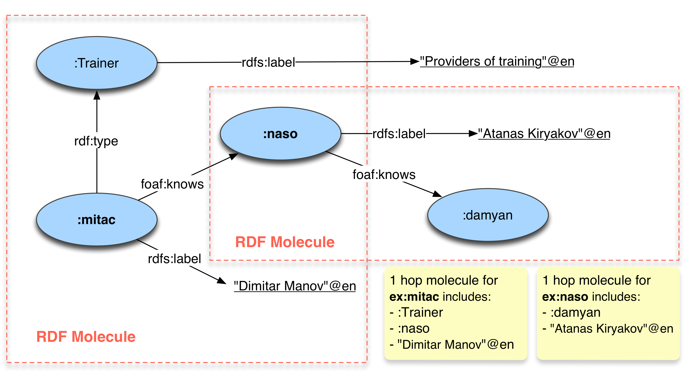

---
# Lucene full-text search
---

<details open="open">
  <summary>What’s in this document?</summary>
  <ul>
    <li>
      <a href="#rdf-search">RDF search</a>
      <ul>
        <li><a href="#usage">Usage</a></li>
      </ul>
      <ul>
        <li><a href="#parameters">Parameters</a></li>
      </ul>
            <ul>
        <li><a href="#creating-an-index">Creating an index</a></li>
      </ul>
            <ul>
        <li><a href="#incremental-update">Incremental update</a></li>
      </ul>
    </li>
  </ul>
</details>

###### The Lucene full-text search plugin has been deprecated from GraphDB version 9.7.x onwards. See how to achieve the same with the extended functionalities of the GraphDB Connectors in [general-full-text-search-with-connectors](https://graphdb.ontotext.com/documentation/enterprise/general-full-text-search-with-connectors.html)

Full-text search (FTS) concerns retrieving text documents out of a large
collection by keywords or, more generally, by tokens (represented as
sequences of characters). Formally, the query represents an unordered
set of tokens and the result is a set of documents, relevant to the
query. In a simple FTS implementation, relevance is Boolean: a document
is either relevant to the query, if it contains all the query tokens, or
not. More advanced FTS implementations deal with a degree of relevance
of the document to the query, usually judged on some sort of measure of
the frequency of appearance of each of the tokens in the document,
normalized, versus the frequency of their appearance in the entire
document collection. Such implementations return an ordered list of
documents, where the most relevant documents come first.

FTS and structured queries, like these in database management systems
(DBMS), are different information access methods based on a different
query syntax and semantics, where the results are also displayed in a
different form. FTS systems and databases usually require different
types of indexes, too. The ability to combine these two types of
information access methods is very useful for a wide range of
applications. Many relational DBMS support some sort of FTS (which is
integrated in the SQL syntax) and maintain additional indexes that allow
efficient evaluation of FTS constraints.

Typically, a relational DBMS allows you to define a query, which
requires specific tokens to appear in a specific column of a specific
table. In SPARQL, there is no standard way for the specification of FTS
constraints. In general, there is neither a well-defined nor commonly
accepted concept for FTS in RDF data. Nevertheless, some semantic
repository vendors offer some sort of FTS in their engines.

RDF search
==========

The GraphDB FTS implementation, called \'RDF Search\', is based on
Lucene. It enables GraphDB to perform complex queries against character
data, which significantly speeds up the query process. RDF Search allows
for efficient extraction of RDF resources from huge datasets, where
ordering of the results by relevance is crucial.

Its main features are:

-   FTS query form - List of tokens (with Lucene query extensions);
-   Result form - Ordered list of URIs;
-   Textual Representation - Concatenation of text representations of
    nodes from the so called \'molecule\' (1-step neighbourhood in a
    graph) of the URI;
-   Relevance - Vector-space model, reflecting the degree of relevance
    of the text and the RDF rank of the URI;
-   Implementation - The Lucene engine is integrated and used for
    indexing and search.

Usage
-----

In order to use the FTS in GraphDB, first a Lucene index must be
computed. Before it is created, each index can be parametrized in a
number of ways, using SPARQL \'control\' updates.

This provides the ability to:

-   select what kinds of nodes are indexed (URIs/literals/blank-nodes);
-   select what is included in the \'molecule\' associated with each
    node;
-   select literals with certain language tags;
-   choose the size of the RDF \'molecule\' to index;
-   choose whether to boost the relevance of the nodes using RDF Rank
    values;
-   select alternative analyzers;
-   select alternative scorers.

In order to use the indexing behavior of Lucene, a text document must be
created for each node in the RDF graph to be indexed. This text document
is called an \'RDF molecule\' and is made up of other nodes reachable
via the predicates that connect the nodes to each other. Once a molecule
has been created for each node, Lucene generates an index over these
molecules. During search (query answering), Lucene identifies the
matching molecules and GraphDB uses the associated nodes as variables
substitutions, when evaluating the enclosing SPARQL query.

The scope of an RDF molecule includes the starting node and its
neighbouring nodes, which are reachable via the specified number of
predicate arcs. For each Lucene index, it can be specified what type of
nodes are indexed and what type of nodes are included in the molecule.
Furthermore, the size of the molecule can be controlled by specifying
the number of allowed traversals of predicate arcs starting from the
molecule centre (the node being indexed).



###### Blank nodes are never included in the molecule. If a blank node is encountered, the search is extended via any predicate to the next nearest entity and so on. Therefore, even when the molecule size is 1, entities reachable via several intermediate predicates can still be included in the molecule if all the intermediate entities are blank nodes.


Parameters
----------

**`Exclude`**

Predicate: `http://www.ontotext.com/owlim/lucene#exclude`  
Default: `<none>`  
Description: Provides a regular expression to identify nodes, which will be excluded from the molecule.
<ul style="list-style: none;">
    Note that for literals and URI local names the regular expression is
  case-sensitive.   
  The example given below will cause matching URIs (e.g., <code>http://example.com/uri#helloWorld</code>) and literals (e.g., <code>"hello world!"</code>) not to be included.

</ul>   
  Example:

```SPARQL
PREFIX luc: <http://www.ontotext.com/owlim/lucene#>
INSERT DATA {
    luc:exclude luc:setParam "hello.*"
}
```

  
**`Exclude entities`**

Predicate: `http://www.ontotext.com/owlim/lucene#excludeEntities`  
Default:`<none>`  
Description: A comma/semi-colon/white-space separated list of
  entities that will NOT be included in an RDF molecule. The example
  below includes any URI in a molecule, except the two listed.  
Example:
```sparql
PREFIX luc: <http://www.ontotext.com/owlim/lucene#>
INSERT DATA {
    luc:excludeEntities luc:setParam
        "http://www.w3.org/2000/01/rdf-schema#Class http://www.example.com/dummy#E1"
}
```

  
**`Exclude Predicates`**

Predicate:`http://www.ontotext.com/owlim/lucene#excludePredicates`  
Default: `<none>`  
Description: A comma/semi-colon/white-space separated list of
  properties that will NOT be traversed in order to build an RDF
  molecule. The example below prevents any entities being added to an
  RDF molecule, if they can only be reached via the two given
  properties.  
Example:

```sparql
PREFIX luc: <http://www.ontotext.com/owlim/lucene#>
INSERT DATA {
    luc:excludePredicates luc:setParam
        "http://www.w3.org/2000/01/rdf-schema#subClassOf http://www.example.com/dummy#p1"
}
```

**`Include`**

Predicate: `http://www.ontotext.com/owlim/lucene#include`
Default:`"literals"`
Description: Indicates what kinds of nodes are to be included in
  the molecule. The value can be a list of values from: URI, literal,
  centre (the plural forms are also allowed: URIs, literals, centres).
  The value of `centre` causes the node for which the molecule is built
  to be added to the molecule (provided it is not a blank node). This
  can be useful, for example, when indexing URI nodes with molecules
  that contain only literals, but the local part of the URI should also
  be searchable.  
Example:

```sparql
PREFIX luc: <http://www.ontotext.com/owlim/lucene#>
INSERT DATA {
    luc:include luc:setParam "literal uri"
}
```

**`Include entities`**

Predicate: `http://www.ontotext.com/owlim/lucene#includeEntities`  
Default: `<none>`  
Description: A comma/semi-colon/white-space separated list of
  entities that can be included in an RDF molecule. Any other entities
  are ignored. The example below builds molecules that only contain the
  two entities.  
Example:

```sparql
PREFIX luc: <http://www.ontotext.com/owlim/lucene#>
INSERT DATA {
    luc:includeEntities luc:setParam
        "http://www.w3.org/2000/01/rdf-schema#Class http://www.example.com/dummy#E1"
}
```

**`Include predicates`**

Predicate: `http://www.ontotext.com/owlim/lucene#includePredicates`  
Default:`<none>`  
Description: A comma/semi-colon/white-space separated list of
  properties that can be traversed in order to build an RDF molecule.
  The example below allows any entities to be added to an RDF molecule,
  but only if they can be reached via the two given properties.  
Example:

```sparql
PREFIX luc: <http://www.ontotext.com/owlim/lucene#>
INSERT DATA {
    luc:includePredicates luc:setParam
        "http://www.w3.org/2000/01/rdf-schema#subClassOf http://www.example.com/dummy#p1"
}
```

**`Index`**

Predicate: `http://www.ontotext.com/owlim/lucene#index`  
Default: `"literals"`  
Description: Indicates what kinds of nodes are to be indexed. The
  value can be a list of values from: URI, literal, bnode (the plural
  forms are also allowed: URIs, literals, bnodes).  
Example:

```sparql
PREFIX luc: <http://www.ontotext.com/owlim/lucene#>
INSERT DATA {
    luc:index luc:setParam "literals, bnodes"
}
```

**`Languages`**

Predicate: `http://www.ontotext.com/owlim/lucene#languages`  
Default:`""` (which is used to indicate that literals with any
  language tag are used, including those with no language tag)  
Description: A comma-separated list of language tags. Only
  literals with the indicated language tags are included in the index.
  To include literals that have no language tag, use the special value
  `none`.  
Example:

```sparql
PREFIX luc: <http://www.ontotext.com/owlim/lucene#>
INSERT DATA {
    luc:languages luc:setParam "en,fr,none"
}
```

**`Molecule size`**

Predicate: `http://www.ontotext.com/owlim/lucene#moleculeSize`  
Default: `0`  
Description: Sets the size of the molecule associated with each
  entity. A value of zero indicates that only the entity itself should
  be indexed. A value of 1 indicates that the molecule will contain all
  entities reachable by a single \'hop\' via any predicate (predicates
  not included in the molecule). Note that blank nodes are never
  included in the molecule. If a blank node is encountered, the search
  is extended via any predicate to the next nearest entity and so on.
  Therefore, even when the molecule size is 1, entities reachable via
  several intermediate predicates can still be included in the molecule,
  if all the intermediate entities are blank nodes. Molecule sizes of 2
  and more are allowed, but with large datasets it can take a very long
  time to create the index.  
Example:
```sparql
PREFIX luc: <http://www.ontotext.com/owlim/lucene#>
INSERT DATA {
    luc:moleculeSize luc:setParam "1"
}
```

**`useRDFRank`**

Predicate: `http://www.ontotext.com/owlim/lucene#useRDFRank`  
Default: `"no"`  
Description: Indicates whether the RDF weights (if they have been
  already computed) associated with each entity should be used as
  boosting factors when computing the relevance of a given Lucene query.
  Allowable values are `no`, `yes` and `squared`. The last value
  indicates that the square of the RDF Rank value is to be used.  
Example:

```sparql
PREFIX luc: <http://www.ontotext.com/owlim/lucene#>
INSERT DATA {
    luc:useRDFRank luc:setParam "yes"
}
```

**`analyzer`**

Predicate: `http://www.ontotext.com/owlim/lucene#analyzer`  
Default: `<none>`  
Description: Sets an **alternative analyzer** for processing text
  to produce terms to index. By default, this parameter has no value and
  the default analyzer used is:
  `org.apache.lucene.analysis.standard.StandardAnalyzer` An alternative
  analyzer must be derived from: `org.apache.lucene.analysis.Analyzer`.
  To use an alternative analyzer, use this parameter to identify the
  name of a Java factory class that can instantiate it. The factory
  class must be available on the Java virtual machine\'s classpath and
  must implement this interface:
  `com.ontotext.trree.plugin.lucene.AnalyzerFactory`.  
Example:

```sparql
PREFIX luc: <http://www.ontotext.com/owlim/lucene#>
INSERT DATA {
    luc:analyzer luc:setParam "com.ex.MyAnalyserFactory"
}
```

Detailed example: In this example, we create two Java classes
  (Analyzer and Factory) and then create a Lucene index, using the
  custom analyzer. This custom analyzer filters the accents
  (diacritics), so a search for \"Beyonce\" finds labels \"Beyoncé\".

```java
public class CustomAnalyzerFactory implements com.ontotext.trree.plugin.lucene.AnalyzerFactory {
    @Override
    public Analyzer createAnalyzer() {
        CustomAnalyzer ret =  new CustomAnalyzer(Version.LUCENE_36);
        return ret;
    }

    @Override
    public boolean isCaseSensitive() {
        return false;
    }
}
```

```java
public class CustomAnalyzer extends StopwordAnalyzerBase {
    public CustomAnalyzer(Version matchVersion){
        super(matchVersion, StandardAnalyzer.STOP_WORDS_SET);
    }

    @Override
    protected TokenStreamComponents createComponents(String fieldName, Reader reader) {
        final Tokenizer source = new StandardTokenizer(matchVersion, reader);
        TokenStream tokenStream = source;
        tokenStream = new StandardFilter(matchVersion, tokenStream);
        tokenStream = new LowerCaseFilter(tokenStream);
        tokenStream = new StopFilter(matchVersion, tokenStream, getStopwordSet());
        tokenStream = new ASCIIFoldingFilter(tokenStream);
        return new TokenStreamComponents(source, tokenStream);
    }
}
```

Create the index:

1.  Put the two classes in a `.jar` file, e.g., \"com.example\"
2.  Put the `.jar` file in the plugins folder (specified by
    `-Dregister-external-plugins=...`, which by default is under
    `<TOMCAT-WEBAPPS>/graphdb-server/WEB-INF/classes/plugins`). There
    has to be some data in the repository.
3.  Create the index.

```sparql
PREFIX luc: <http://www.ontotext.com/owlim/lucene#>
INSERT DATA {
  luc:analyzer luc:setParam "com.example.CustomAnalyzerFactory" .
  luc:index luc:setParam "uris".
  luc:moleculeSize luc:setParam "1".
  luc:myIndex luc:createIndex "true".
}
```

**`scorer`**

Predicate: `http://www.ontotext.com/owlim/lucene#scorer`  
Default:`<none>`  
Description: Sets an **alternative scorer** that provides boosting
  values, which adjust the relevance (and hence the ordering) of results
  to a Lucene query. By default, this parameter has no value and no
  additional scoring takes place, however, if the `useRDFRank` parameter
  is set to `true`, then the RDF Rank scores are used. An alternative
  scorer must implement this interface:
  `com.ontotext.trree.plugin.lucene.Scorer`. In order to use an
  alternative scorer, use this parameter to identify the name of a Java
  factory class that can instantiate it. The factory class must be
  available on the Java virtual machine\'s classpath and must implement
  this interface: `com.ontotext.trree.plugin.lucene.ScorerFactory`.  
Example:

```sparql
PREFIX luc: <http://www.ontotext.com/owlim/lucene#>
INSERT DATA {
    luc:scorer luc:setParam "com.ex.MxScorerFactory"
}
```

Creating an index
-----------------

Once you have set the parameters for an index, you create and name the
index by committing a SPARQL update of this form, where the index name
appears as the subject in the triple pattern:

```sparql
PREFIX luc: <http://www.ontotext.com/owlim/lucene#>
INSERT DATA { luc:myIndex luc:createIndex "true" . }
```

The index name must have the `http://www.ontotext.com/owlim/lucene#`
namespace and the local part can contain only alphanumeric characters
and underscores.

Creating an index can take some time, although usually no more than a
few minutes when the molecule size is 1 or less. During this process,
for each node in the repository, its surrounding molecule is computed.
Then, each such molecule is converted into a single string document (by
concatenating the textual representation of all the nodes in the
molecule) and this document is indexed by Lucene. If the RDF Rank
weights are used (or an alternative scorer is specified), then the
computed values are stored in the Lucene index as a boosting factor that
will later on influence the selection order.

To use a custom Lucene index in a SPARQL query, use the index\'s name as
the predicate in a statement pattern, with the Lucene query as the
object using the full [Lucene
query](http://lucene.apache.org/core/3_0_3/queryparsersyntax.html)
vocabulary.

The following query produces bindings for `?s` from entities in the
repository, where the RDF molecule associated with this entity (for the
given index) contains terms that begin with \"United\". Furthermore, the
bindings are ordered by relevance (with any boosting factor):

```sparql
PREFIX luc: <http://www.ontotext.com/owlim/lucene#>
SELECT ?s
WHERE { ?s luc:myIndex "United*" . }
```

The Lucene score for a bound entity for a particular query can be
exposed using a special predicate:

    http://www.ontotext.com/owlim/lucene#score

This can be useful when the Lucene query results are ordered in a manner
based on but different from the original Lucene score.

For example, the following query orders the results by a combination of
the Lucene score and some ontology defined importance value:

```sparql
PREFIX luc: <http://www.ontotext.com/owlim/lucene#>
PREFIX ex: <http://www.example.com/myontology#>
SELECT * {
  ?node luc:myIndex "lucene query string" .
  ?node ex:importance ?importance .
  ?node luc:score ?score .
} ORDER BY ( ?score + ?importance )
```

The `luc:score` predicate works only on bound variables. There is no
problem disambiguating multiple indexes because each variable is bound
from exactly one Lucene index and hence its score.

The combination of ranking RDF molecules together with FTS provides a
powerful mechanism for querying/analyzing datasets, even when the schema
is not known. This allows for keyword-based search over both literals
and URIs with the results ordered by importance/interconnectedness.

You can see an example of such \'RDF Search\' in
[FactForge](http://factforge.net).

### Detailed example

The following example configuration shows how to index URIs using
literals attached to them by a single, named predicate - in this case
`rdfs:label`.

1.  Assume the following starting data:

    ```sparql
    PREFIX rdfs:<http://www.w3.org/2000/01/rdf-schema#>
    PREFIX ex:<http://example.com#>
    INSERT DATA {
      ex:astonMT rdfs:label "Aston McTalisker" .
      ex:astonMartin ex:link "Aston Martin" .
      <http://www1.aston.ac.uk/> rdfs:label "Aston University"@EN .
    }
    ```

2.  Set up the configuration - index URIs by including, in their RDF
    molecule, all literals that can be reached via a single statement
    using the `rdfs:label` predicate:

    ```sparql
    PREFIX luc: <http://www.ontotext.com/owlim/lucene#>
    INSERT DATA {
      luc:index luc:setParam "uris" .
      luc:include luc:setParam "literals" .
      luc:moleculeSize luc:setParam "1" .
      luc:includePredicates luc:setParam "http://www.w3.org/2000/01/rdf-schema#label" .
    }
    ```

3.  Create a new index called `luc:myTestIndex` - note that the index
    name must be in the `<http://www.ontotext.com/owlim/lucene#>`
    namespace:

    ```sparql
    PREFIX luc: <http://www.ontotext.com/owlim/lucene#>
    INSERT DATA {
      luc:myTestIndex luc:createIndex "true" .
    }
    ```

4.  Use the index in a query - find all URIs indexed using the
    `luc:myTestIndex` index that match the Lucene query \"ast\*\":

    ```sparql
    PREFIX luc: <http://www.ontotext.com/owlim/lucene#>
    SELECT * {
      ?id luc:myTestIndex "ast*"
    }
    ```

The results of this query are:  
| |
|---------------|
| ?id           |
| <http://example.com#astonMT>     |
| <http://www1.aston.ac.uk/> |

showing that `ex:astonMartin` is not returned, because it does not have
an `rdfs:label` linking it to the appropriate text.

Incremental update
------------------

Each Lucene-based FTS index must be recreated from time to time as the
indexed data changes. Due to the complex nature of the structure of RDF
molecules, rebuilding an index is a relatively expensive operation.
Still, indexes can be updated incrementally on a per resource basis as
directed by the user.

The following control update:

```sparql
PREFIX luc: <http://www.ontotext.com/owlim/lucene#>
INSERT DATA { <index-name> luc:addToIndex <resource> . }
```

updates the FTS index for the given resource and the given index.

###### Each index stores the values of the parameters used to define it, e.g., the value of `luc:includePredicates`, therefore there is no need to set them before requesting an incremental update.


The following control update:

```sparql
PREFIX luc: <http://www.ontotext.com/owlim/lucene#>
INSERT DATA { <index-name> luc:updateIndex _:b1 . }
```

causes all resources not currently indexed by `<index-name>` to get
indexed. It is a shorthand way of batching together index updates for
several (new) resources.
